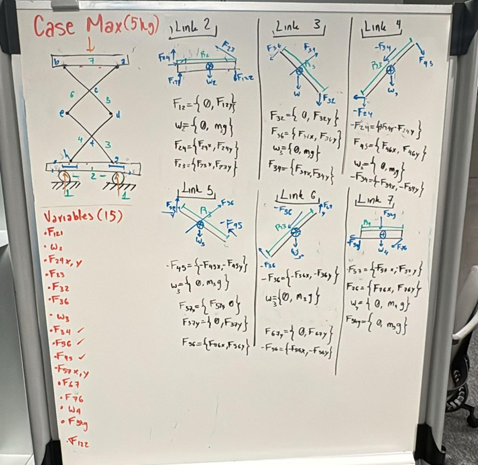
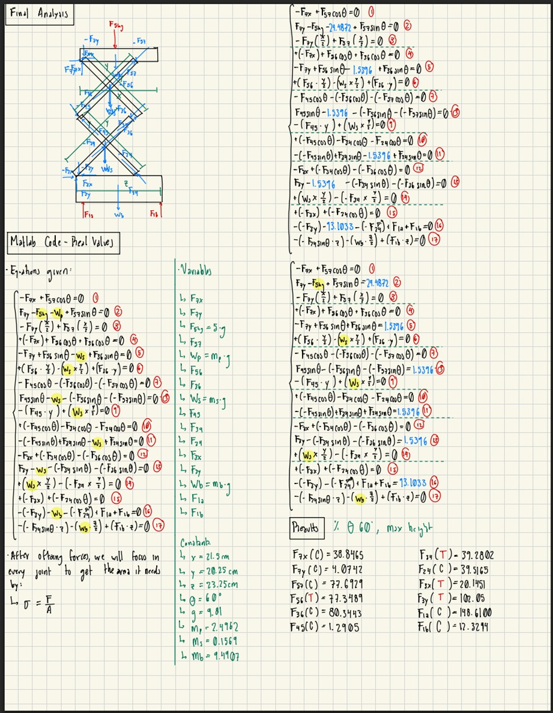
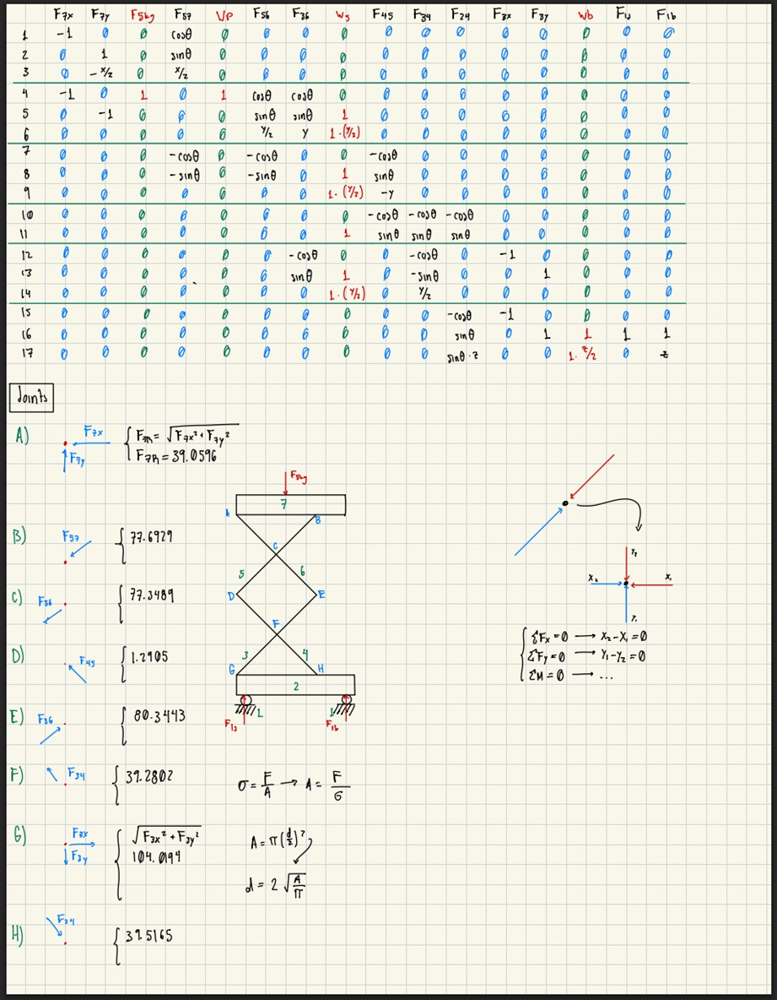
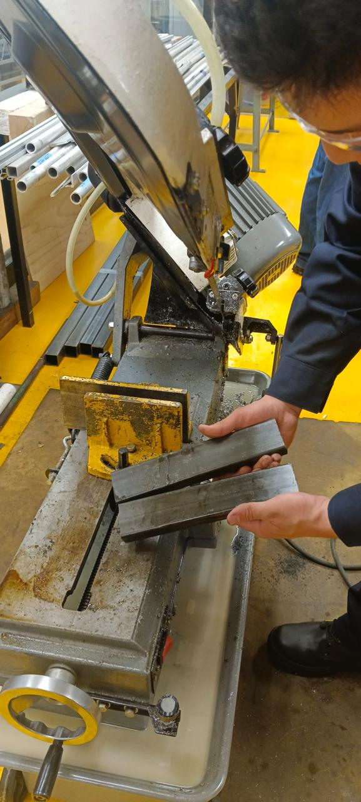
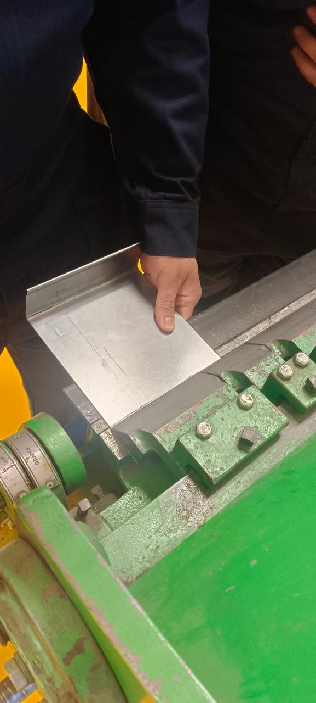
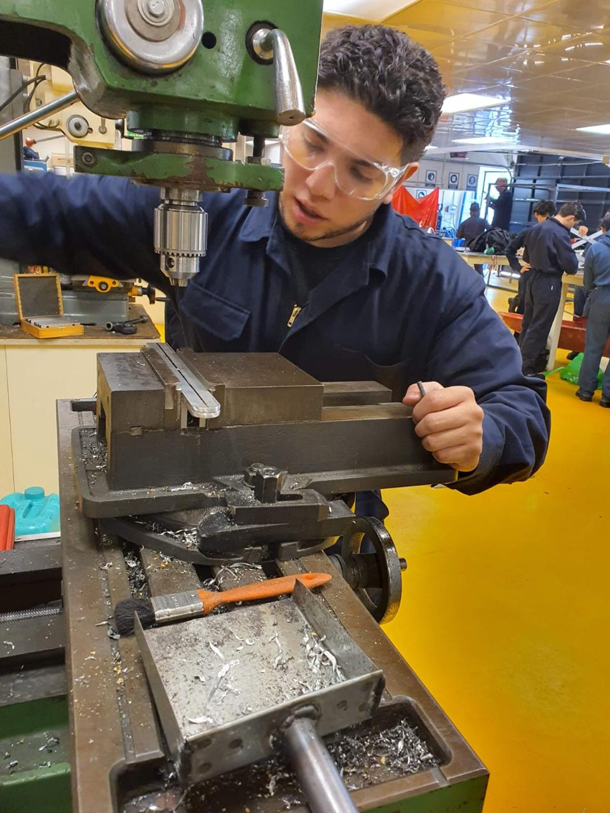
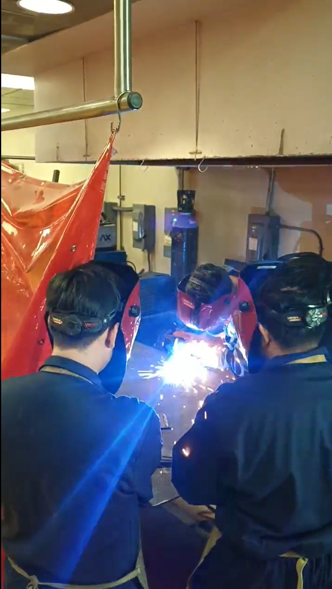
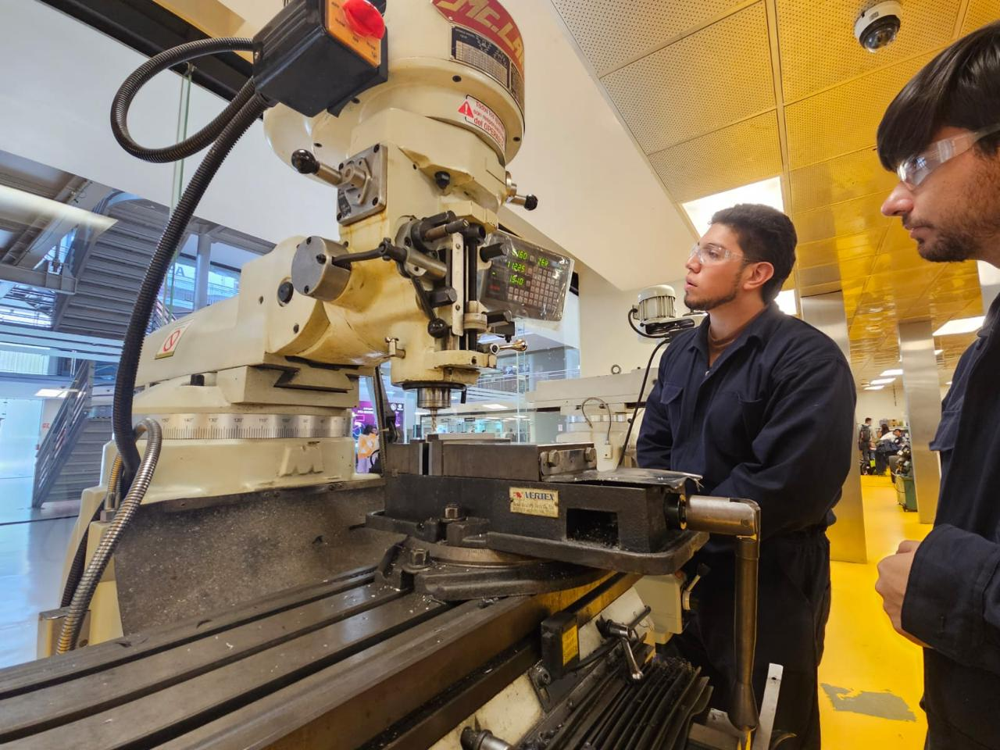
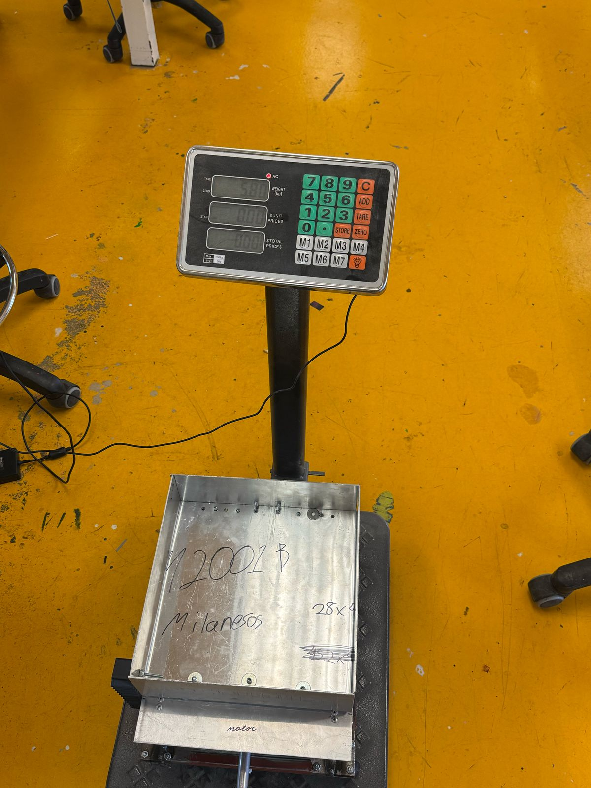
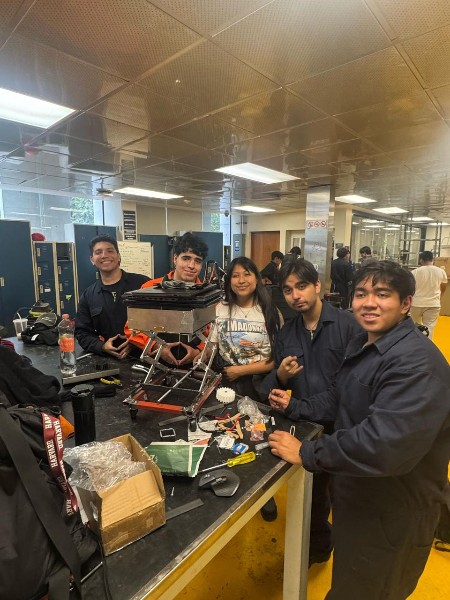

# 4th Semester Challenge - AGV and ScissorLift
This repository contains my contributions to the project, along with the final technical report submitted to the supervising professors, which documents the design, implementation, and results of the work.

The project lasted 15 weeks:
- Weeks 1–5: Project planning and static analysis of the Scissor Lift.
- Weeks 6–10: CAD design and manufacturing of the Scissor Lift and AGV.
- Weeks 11–15: Electronics schematic, connections, and programming.

## Weeks 1 - 5: Project Planning and Static Analysis (Under Refinement)
My contributions focused on static analysis calculations. Two members performed independent analyses to compare results. Here I present my formulation.

### Force and Moment Diagrams

### Digitalized Diagrams and Matrix Formulation

### Preliminary Results (Under Review)
- Internal forces per link were estimated using the matrix-based solution.
- A preliminary stress-based sizing approach was explored using shear stress assumptions.
- These results were used for qualitative comparison between different modeling approaches.

The following calculations correspond to an initial sizing exploration and do not represent final design dimensions.

### Corrections and Lessons Learned

- **Matrix Formatulation**:
- *Initial issue:* known loads and unknown forces were not consistently separated in the equilibrium matrix.
- *Correction implemented:* reformulated the system by isolating unknowns in the coefficient matrix (A) and known loads in the load vector (b).
- *Engineering lesson:* accurate separation of known and unknown terms is critical in matrix-based static models.

- **Stress Evaluation**
- *Initial limitation:* Link sizing was based solely on shear stress assumptions.
- *Planned refinement:** extend the stress analysis to include additional failure modes relevant to scissor lift mechanisms:
- *Buckling:* instability of slender members under compressive loads.
- *Bearing:* localized crushing at pin and plate interfaces.
- *Yielding:* material yielding under axial and combined stresses.
- *Fatigue:* potential crack initiation under repeated load cycles.
- *Engineering lesson:* mechanical design requires evaluating multiple failure modes to ensure structural safety and reliability.

---

## Weeks 6–10: CAD and Manufacturing 
The manufacturing methods we applied during the course were:
- **Sawing:** Mainly for the Scissor Lift, cutting pieces for the body. 

- **Sheet Metal Working:** Mainly for the AGV.

- **Drilling:** Used in both systems to make holes for screws and rivets.

- **Welding:** Mainly in the Scissor Lift, to join the body pieces together.

- **Milling:** Used in the Scissor Lift, enabling lifting and tilting.

- **Lathe:** Initially used to achieve exact component sizes, but later we realized it was more efficient to buy standard measurements.

### Results 
The static analysis helped determine the minimum and optimal dimensions for the Scissor Lift. We differentiated from other teams in: 
- **Weight:** Most other teams built Scissor Lifts weighing more than 20 kg, while ours weighed less than 6 kg. 
 
- **Dimensions:** Other teams’ Scissor Lifts were oversized for the intended load. By performing static analysis, we calculated the optimal dimensions required. 
 

### Corrections and Lessons Learned 
- **Overchecking dimensions:** 
  - Due to lack of manufacturing experience, we assumed it would be easy to achieve exact dimensions to avoid material waste. In practice, it was time-consuming and difficult, resulting in broken pieces and rework. 
	- It was also challenging to find already-manufactured parts (like bearings) matching our calculated sizes. We learned that using **standard components** is often more practical and reliable.

---

## Weeks 11–15: Electronics and Programming (Under Refinement)
*(Content to be added)*

