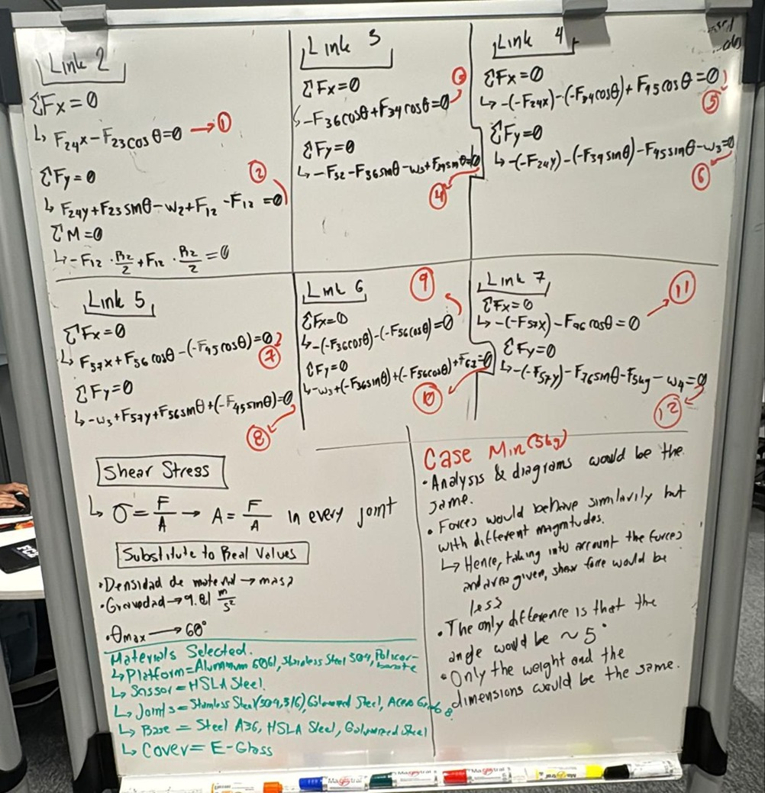
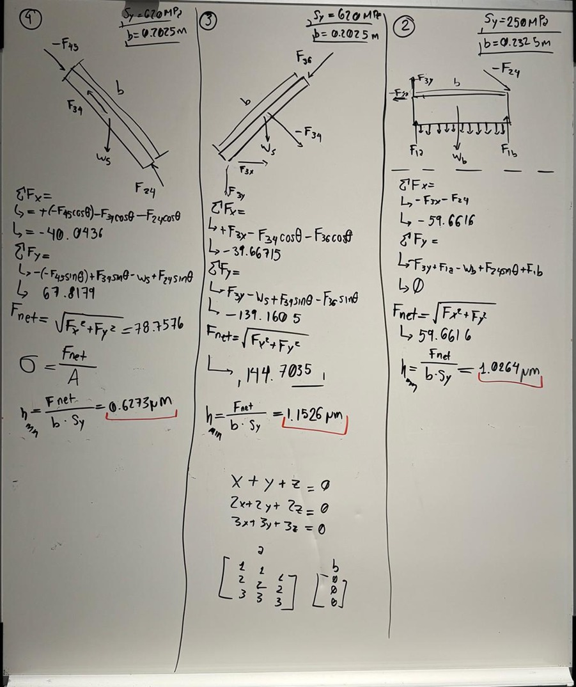

# 4th Semester Challenge - AGV and ScissorLift
This repository contains my contributions to the project, along with the final technical report submitted to the supervising professors, which documents the design, implementation, and results of the work.

The project lasted 15 weeks:
- Weeks 1–5: Project planning and static analysis of the Scissor Lift.
- Weeks 6–10: CAD design and manufacturing of the Scissor Lift and AGV.
- Weeks 11–15: Electronics schematic, connections, and programming.

## Weeks 1 - 5: Project Planning and Static Analysis (Under Refinement)
My contributions focused on static analysis calculations. Two members performed independent analyses to compare results. While at the end we decided to use the other teammate's approach, here I present my formulation.

### Force and Moment Diagrams

### Digitalized Diagrams and Matrix Formulation

### Results
- Net forces per link calculated.
- Shear stress applied to determine required cross-sectional area.
- Minimum link height estimated assuming rectangular cylinder geometry.

### Corrections and Lessons Learned

- **Initial issue (matrix formulation):** known loads and unknown forces were not consistently separated in the equilibrium matrix.
- **Correction implemented:** reformulated the system by isolating unknowns in the coefficient matrix (A) and known loads in the load vector (b).
- **Engineering lesson:** accurate separation of known and unknown terms is critical in matrix-based static models.

- **Initial limitation (stress evaluation):** link sizing was based solely on shear stress assumptions.
- **Planned refinement:** extend the stress analysis to include additional failure modes relevant to scissor lift mechanisms:
  - **Buckling:** instability of slender members under compressive loads.
  - **Bearing:** localized crushing at pin and plate interfaces.
  - **Yielding:** material yielding under axial and combined stresses.
  - **Fatigue:** potential crack initiation under repeated load cycles.
- **Engineering lesson:** mechanical design requires evaluating multiple failure modes to ensure structural safety and reliability.

## Weeks 6–10: CAD and Manufacturing
*(Content to be added)*

## Weeks 11–15: Electronics and Programming (Under Refinement)
*(Content to be added)*

